# 🛍️ POS KMP (Point of Sale Simulation)

**PDV KMP** is an **open-source Kotlin Multiplatform (KMP)** project that simulates a **Point of Sale (POS / PDV)** system, running on **mobile (Android & iOS)** and **desktop (JVM)** from a single shared codebase.

This project was built as a **portfolio and learning-driven initiative**, focusing on **clean architecture**, **modern state management**, and **real-world business scenarios** commonly found in retail systems.

---

## Mobile Android/Ios
<h2>Sync/Home</h2>
<div style="display: flex; flex-wrap: wrap; gap: 15px;">
    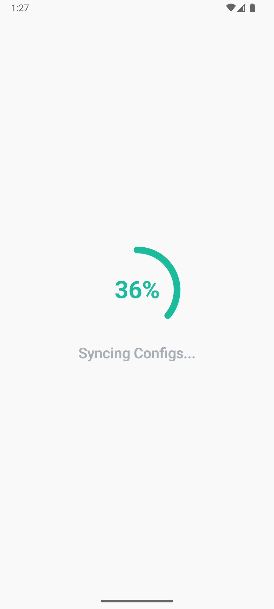
    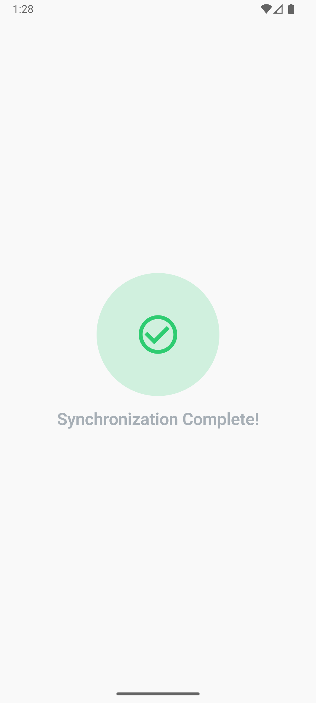
    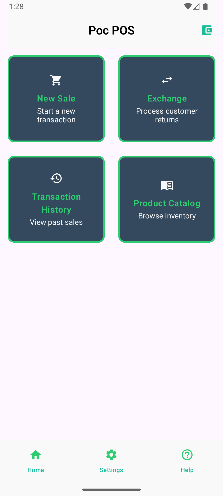
</div>
<br/>
<h2>Sales</h2>
<div style="display: flex; flex-wrap: wrap; gap: 15px;">
    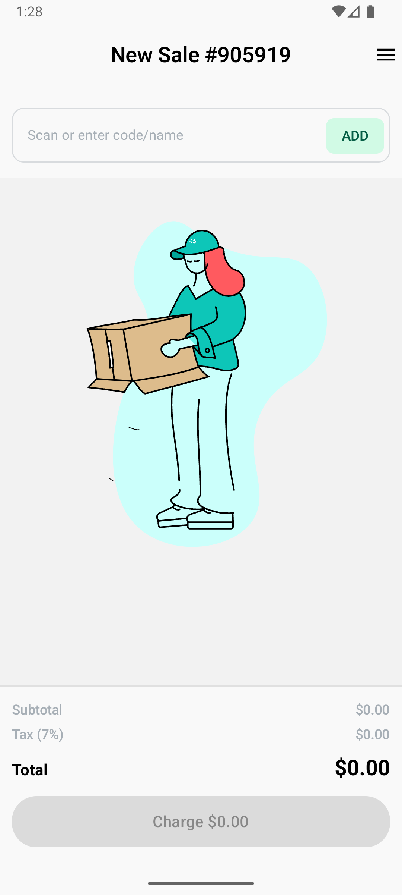
    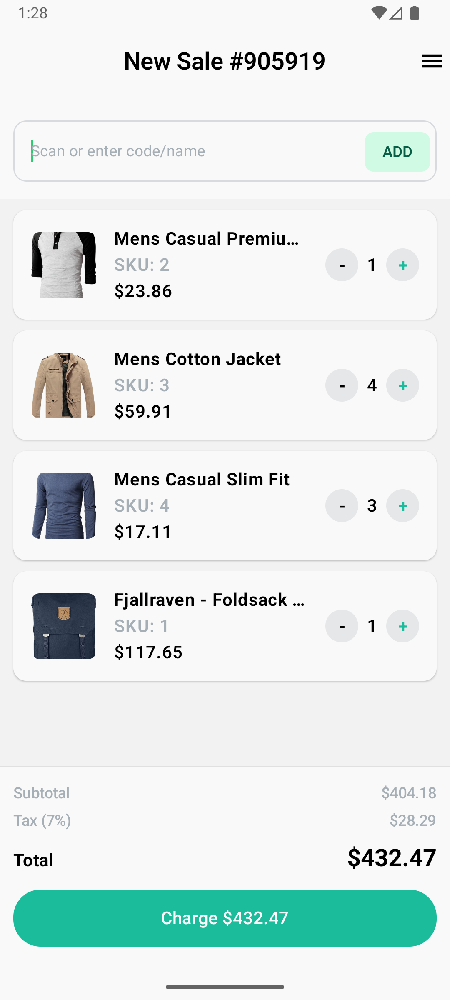
    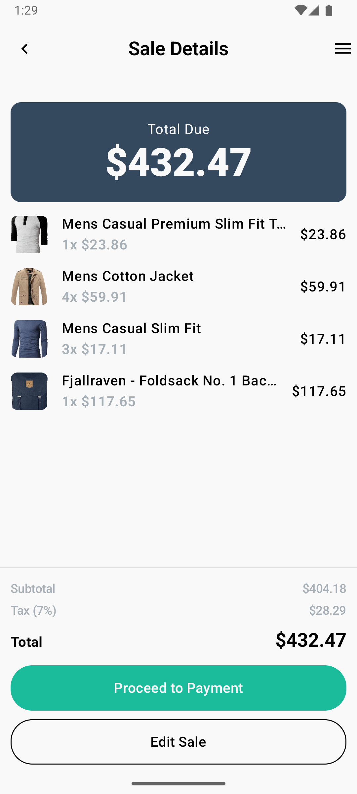
    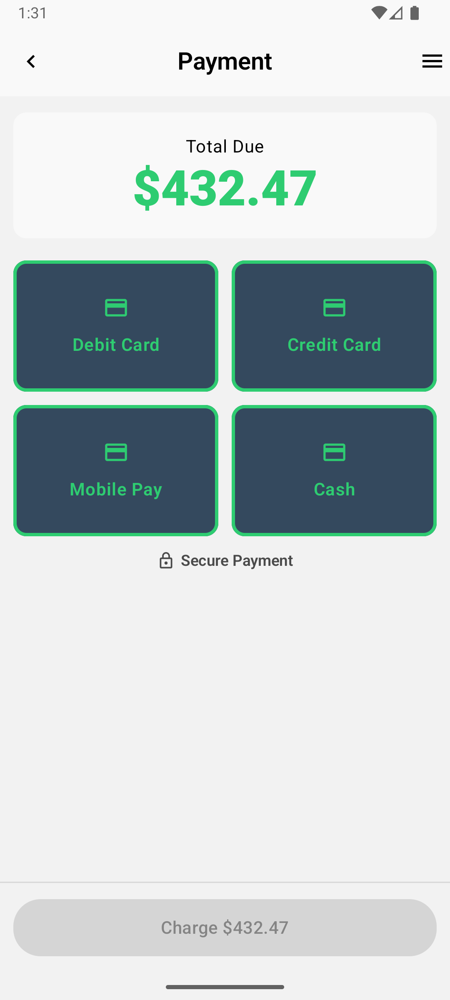
    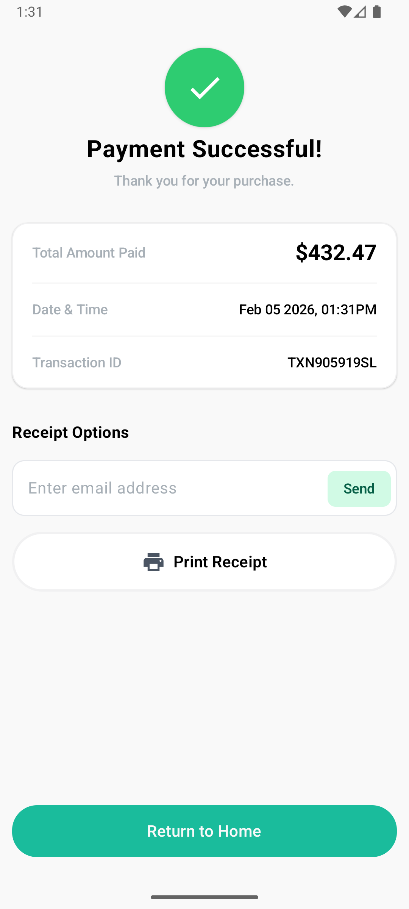
</div>
<br/>
<h2>Exchange</h2>
<div style="display: flex; flex-wrap: wrap; gap: 15px;">
    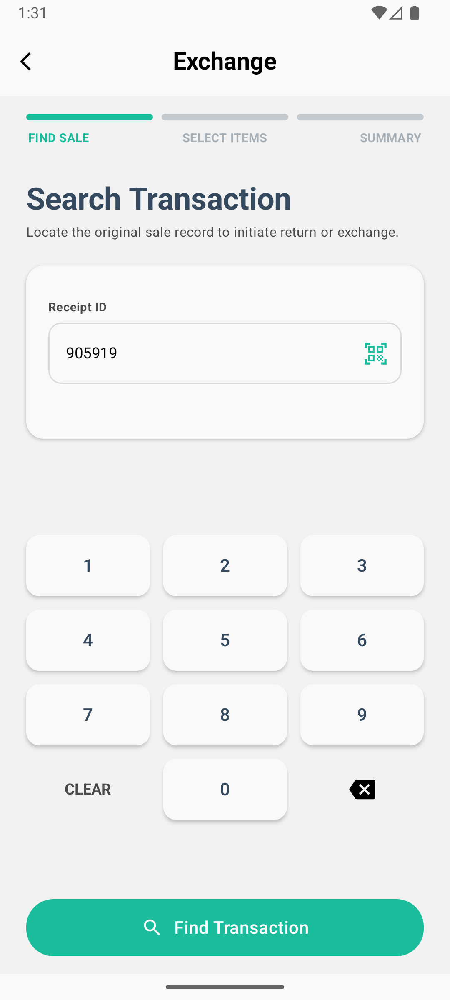
    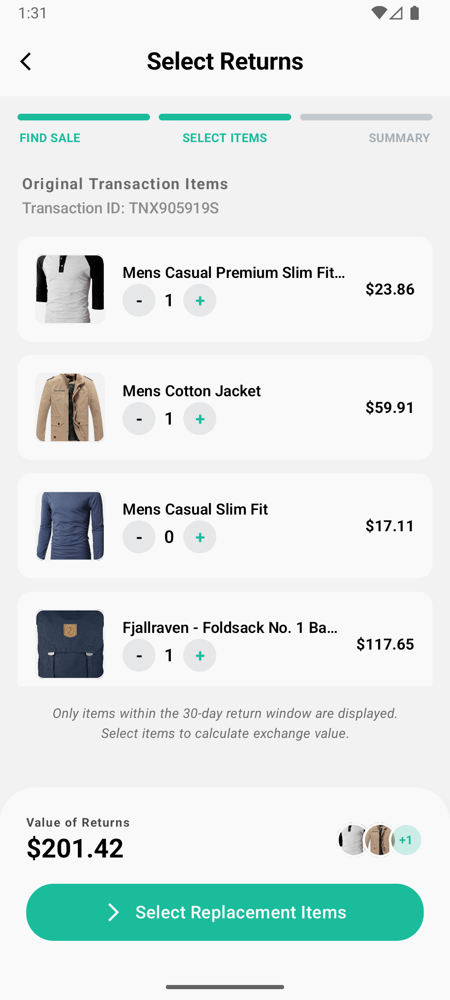
    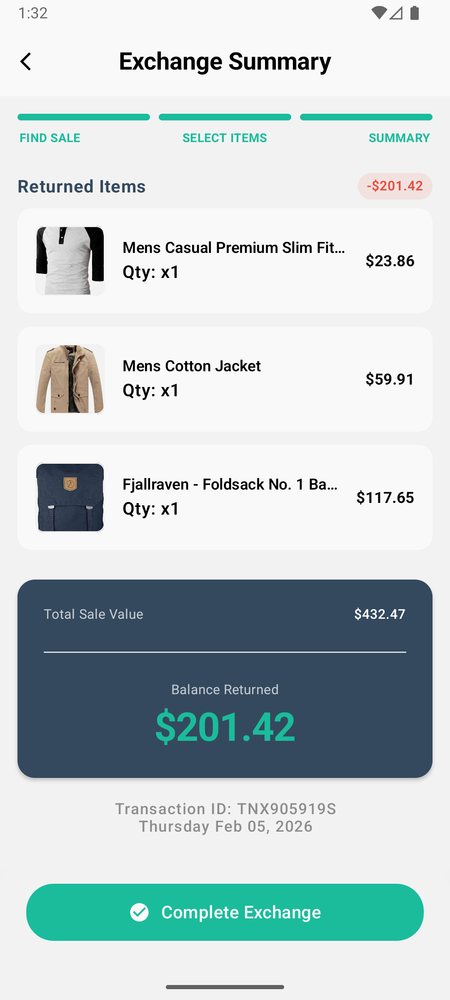
</div>
<br/>
<h2>Transactions</h2>
<div style="display: flex; flex-wrap: wrap; gap: 15px;">
    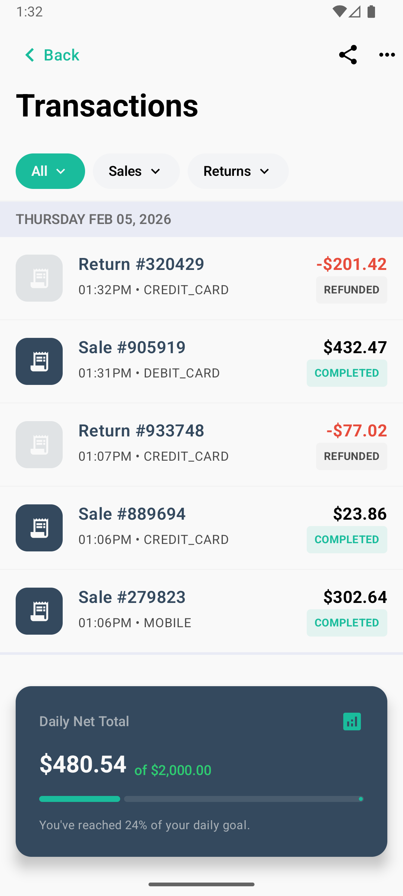
    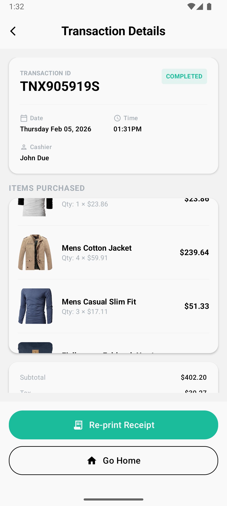
    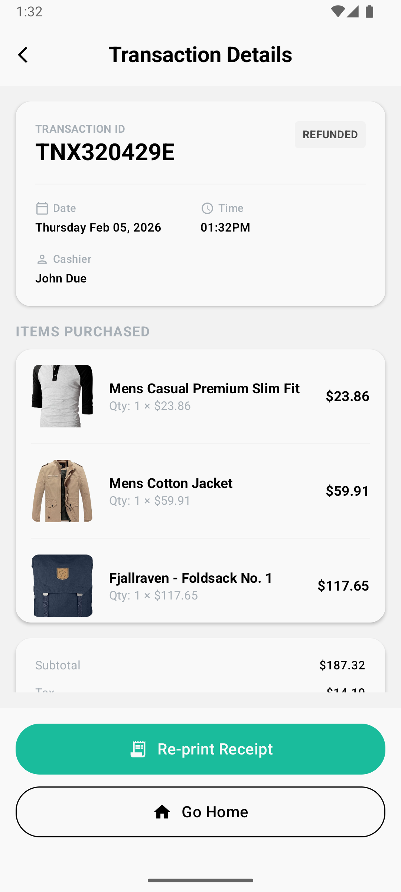
</div>

## Desktop
### Desktop Mac, Linux and windows
<div style="display: flex; justify-content: center; align-items: flex-start; flex-wrap: wrap; gap: 15px;">
    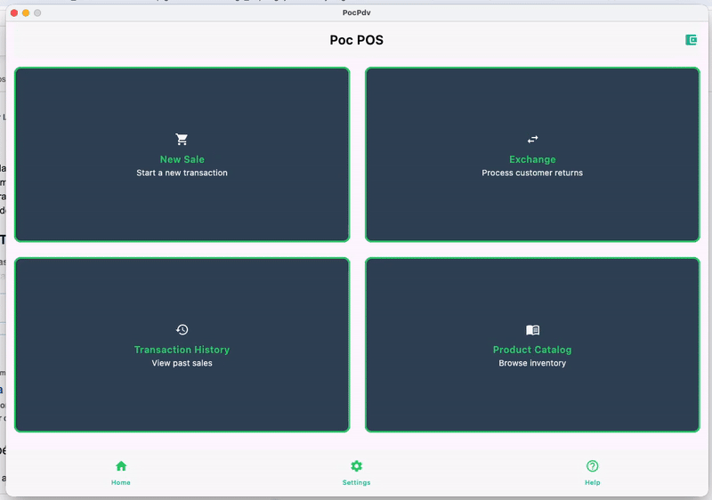
    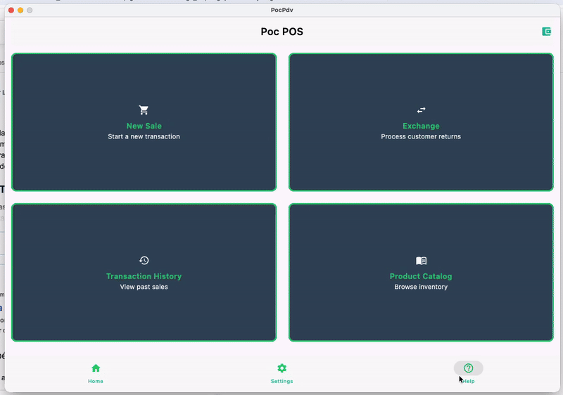
    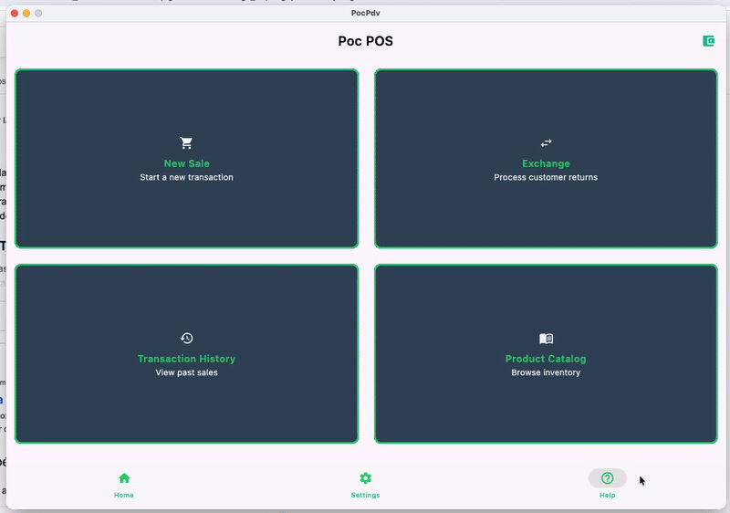
</div>

## ✨ What This Project Is About

The goal of this project is to demonstrate how a **realistic POS domain** can be modeled using **Kotlin Multiplatform** while keeping the codebase:

- Modular
- Scalable
- Testable
- Easy to evolve

It serves both as:
- A **technical showcase** of KMP + Compose Multiplatform
- A **reference project** for MVVM / MVI architecture in multiplatform apps

---

## 🛒 Business Domain (POS Simulation)

The application simulates core POS workflows, including:

### 💳 Sales
- Registering product sales
- Managing sale state and totals
- Simulating a complete sale flow

### 🔁 Exchanges / Returns
- Handling product exchanges
- Linking exchanges to previous sales
- Reflecting changes in transaction history

### 📑 Transactions
- Centralized transaction tracking
- Unified representation of sales and exchanges
- Foundation for reporting or persistence layers

The domain is intentionally simple but realistic, making it easy to extend with new features.

---

## 🏗️ Architecture & Tech Stack

- **Kotlin Multiplatform (KMP)**
    - Shared business and presentation logic
- **Compose Multiplatform**
    - UI shared across Android and Desktop
*   **Networking:**
    *   **Ktor:** A framework for creating asynchronous clients and servers in Kotlin, used here for network requests.
    *   **Kotlinx Serialization:** For handling JSON serialization and deserialization.
*   **Asynchronous Programming:**
    *   **Kotlinx Coroutines:** For asynchronous programming.
*   **Utilities:**
    *   **Kotlinx Datetime:** For handling date and time operations.
*   **Databases:**
    *   **Room:** An Android Architecture Component for SQLite database access.
*   **Backend Services:**
    *   **Firebase:** Used for push notifications (Firebase Messaging).
*   **Image Loading:**
    *   **Coil:** An image loading library for Android and Compose.
- **MVVM / MVI**
    - Clear separation of concerns
    - Unidirectional data flow
- **Reactive and asynchronous state management**
    - **Coroutines & Flow**


This combination provides predictable state handling and a clean development experience across targets.

---


## 📁 Project Structure (Simplified)

```
    pdv-kmp/
    ├─ composeApp/
    │ ├─ commonMain/ # App entry point
    │ ├─ androidMain/ # Android-specific implementations
    │ ├─ iosMain/ # iOS-specific implementations
    │ └─ jvmMain/ # Desktop (JVM) implementations
    ├─ iosApp/ # iOS application entry point
    ├─ core/ # Domain and business logic
    ├─ feature/ # POS features (sale, exchange, transactions)
    └─ build-logic/ # Gradle configuration and build logic
```
